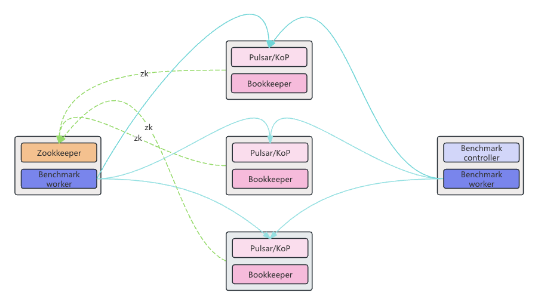
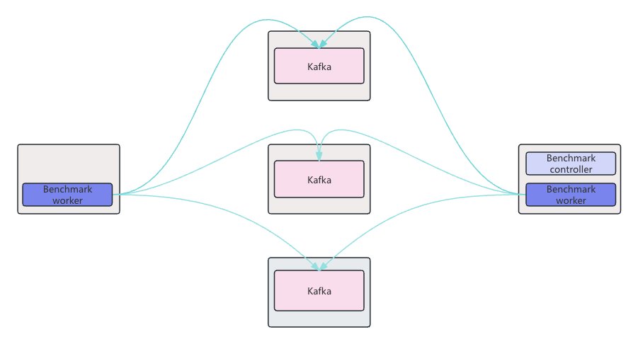

# KoP性能测试

## 1. 测试范围

KoP, Pulsar, Kafka, KoP Proxy

## 2. 测试工具

[OpenMessaging benchmark](https://github.com/ascentstream/benchmark)

## 3. 测试环境

- 硬件配置
  - CPU: VCPU 4
  - Memory: 32GB
  - 网络: 1Gbps
  - 磁盘: 1TB SSD * 2 (Read: MB/s, Write: MB/s)
- 软件配置
  - OS: CentOS 7.9
  - Java: Oracle JDK 17
  - Pulsar: [2.10.7.1](https://github.com/ascentstream/pulsar/releases/tag/v2.10.7.1)
  - Kafka: 3.4.1
  - KoP: [2.10.7.1](https://github.com/ascentstream/asp-kop/releases/tag/v2.10.7.1)
  - Bookkeeper: 4.14.8
  - Zookeeper: 3.9.2
  - [OpenMessaging benchmark](https://github.com/ascentstream/benchmark) 0.0.1

## 4. 测试部署

- 硬件需求
  - 5台机器，每台机器配置[如上](#3-测试环境)
- 部署方式
  - Pulsar/KoP

  

  - Kafka

  

## 5. 相关核心配置

- Durability Level
  - Level1:
    - KoP/Pulsar:
      - Replication: SYNC(ensemble=3, writeQuorum=3, ackQuorum=2)
      - Bookkeeper(ASYNC):
        - Enable journaling
          - journalWriteData=true
          - journalSyncData=false
        - Disable journaling
          - journalWriteData=false
          - journalSyncData=false
    - Kafka:
      - Replication: SYNC(ack=all, min.insync.replicas=2)
      - Log: ASYNC(log.flush.interval.messages=10000, log.flush.interval.ms=1000)
  - Level2:
    - KoP/Pulsar:
    - Replication: ASYNC(ensemble=3, writeQuorum=3, ackQuorum=1)
    - Bookkeeper(ASYNC):
      - Enable journaling
        - journalWriteData=true
        - journalSyncData=false
      - Disable journaling
        - journalWriteData=false
        - journalSyncData=false
    - Kafka:
      - Replication: ASYNC(ack=1, min.insync.replicas=2)
      - Log: ASYNC(log.flush.interval.messages=10000, log.flush.interval.ms=1000)
- Pulsar
  - Broker.conf

    ```properties
    managedLedgerNewEntriesCheckDelayInMillis=0
    bookkeeperNumberOfChannelsPerBookie=64

    # use sync replication mode
    managedLedgerDefaultEnsembleSize=3
    managedLedgerDefaultWriteQuorum=3
    managedLedgerDefaultAckQuorum=2
    ```
  - Bookkeeper.conf

    ```properties
    journalPageCacheFlushIntervalMSec=1000

    # disable/enable journaling
    journalWriteData=false/true
    journalSyncData=false
    ```
  - Broker JVM options

    ```text
    -Xmx6G -Xms6G -XX:MaxDirectMemorySize=6G
    ```
  - Bookkeeper JVM options

    ```text
    -Xmx6G -Xms6G -XX:MaxDirectMemorySize=6G
    ```
  - Client Settings

    ```properties
    # Producer
    batchingPartitionSwitchFrequencyByPublishDelay=2
    # Consumer
    maxTotalReceiverQueueSizeAcrossPartitions=5000000
    ```
- KoP
  - 基本设置如Pulsar
  - KoP设置

    ```properties
    entryFormat=kafka
    ```
- Kafka
  - Broker.conf

    ```properties
    ```
  - Broker JVM options

    ```text
    -Xmx12G -Xms12G -XX:MaxDirectMemorySize=12G
    ```
- Benchmark
  - Driver config
    - [Pulsar](../driver-pulsar/pulsar_asp_perf.yaml)
    - [KoP](../driver-kop/kafka_to_kafka_asp_perf.yaml)
    - [Kafka](../driver-kafka/kafka-ack-all-nofsync.yaml)

## 6. 测试场景

- 场景

| 场景 | Topics | Partitions per topic | Producers | Subscriptions | Consumers per subscription | Message Size |                                                       Workload                                                       |
|----|--------|----------------------|-----------|---------------|----------------------------|--------------|----------------------------------------------------------------------------------------------------------------------|
| 1  | 1      | 1                    | 1         | 1             | 1                          | 100B         | [1-topic-1-partition-1p-1c-100b](../workloads/asp/max/1-topic-1-partition/1-topic-1-partition-1p-1c-100b.yaml)           |
| 2  | 1      | 1                    | 1         | 1             | 1                          | 1KB          | [1-topic-1-partition-1p-1c-1kb](../workloads/asp/max/1-topic-1-partition/1-topic-1-partition-1p-1c-1kb.yaml)             |
| 3  | 1      | 1                    | 1         | 1             | 1                          | 64KB         | [1-topic-1-partition-1p-1c-64kb](../workloads/asp/max/1-topic-1-partition/1-topic-1-partition-1p-1c-64kb.yaml)           |
| 4  | 1      | 16                   | 1         | 1             | 1                          | 100B         | [1-topic-16-partition-1p-1c-100b](../workloads/asp/max/1-topic-16-partition/1-topic-16-partition-1p-1c-100b.yaml)        |
| 5  | 1      | 16                   | 1         | 1             | 1                          | 1KB          | [1-topic-16-partition-1p-1c-1kb](../workloads/asp/max/1-topic-16-partition/1-topic-16-partition-1p-1c-1kb.yaml)          |
| 6  | 1      | 16                   | 1         | 1             | 1                          | 64KB         | [1-topic-16-partition-1p-1c-64kb](../workloads/asp/max/1-topic-16-partition/1-topic-16-partition-1p-1c-64kb.yaml)        |
| 7  | 1      | 64                   | 4         | 1             | 4                          | 100B         | [1-topic-64-partition-4p-4c-100b](../workloads/asp/max/1-topic-64-partition/1-topic-64-partition-4p-4c-100b.yaml)        |
| 8  | 1      | 64                   | 4         | 1             | 4                          | 1KB          | [1-topic-64-partition-4p-4c-1kb](../workloads/asp/max/1-topic-64-partition/1-topic-64-partition-4p-4c-1kb.yaml)          |
| 9  | 1      | 64                   | 4         | 1             | 4                          | 64KB         | [1-topic-64-partition-4p-4c-64kb](../workloads/asp/max/1-topic-64-partition/1-topic-64-partition-4p-4c-64kb.yaml)        |
| 10 | 1      | 512                  | 16        | 1             | 16                         | 100B         | [1-topic-512-partition-16p-16c-100b](../workloads/asp/max/1-topic-512-partition/1-topic-512-partition-16p-16c-100b.yaml) |
| 11 | 1      | 512                  | 16        | 1             | 16                         | 1KB          | [1-topic-512-partition-16p-16c-1kb](../workloads/asp/max/1-topic-512-partition/1-topic-512-partition-16p-16c-1kb.yaml)   |
| 12 | 1      | 512                  | 16        | 1             | 16                         | 64KB         | [1-topic-512-partition-16p-16c-64kb](../workloads/asp/max/1-topic-512-partition/1-topic-512-partition-16p-16c-64kb.yaml) |

- 后续规划

增加Catch-up read测试

- 测试步骤
  - 启动Pulsar/KoP/Kafka集群
  - 启动benchmark driver
  - 运行测试场景
  - 结果分析
- 关注指标
  - 吞吐量
    - Publish Throughput(Message, Byte)
    - Consume Throughput(Message, Byte)
  - 延迟:
    - Publish Latency(AVG, MAX, P90, P99, P999)
    - End-to-End Latency(AVG, MAX, P90, P99, P999)

## 7. 测试数据

- 场景1
  - Pulsar
    - Enable journaling
      - Benchmark result:
      - CPU:
      - Memory:
      - Disk:
    - Disable journaling
      - Benchmark result:
      - CPU:
      - Memory:
      - Disk:
  - KoP
    - Enable journaling
      - Benchmark result:
      - CPU:
      - Memory:
      - Disk:
    - Disable journaling
      - Benchmark result:
      - CPU:
      - Memory:
      - Disk:
  - Kafka
    - Benchmark result:
    - CPU:
    - Memory:
    - Disk:

## 8. 结果分析

TODO

## 9. 参考文档

- [StreamNative: Kafka-Pulsar Performance Test Report](https://github.com/streamnative/openmessaging-benchmark/blob/master/blog/benchmarking-pulsar-kafka-a-more-accurate-perspective-on-pulsar-performance.pdf)
- [Confluent: Kafka fastest messaging system](https://www.confluent.io/blog/kafka-fastest-messaging-system/)

